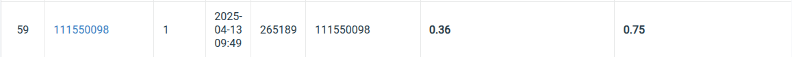

# DLCV 2025 HW1

name: 楊宗儒
id: 111550098

## Introduction

In this homework, the task is to detect the digits in some outdoor images of door plates and predict the entire number on them with Faster-RCNN based models.

## How to install

### Dataset
```
gdown 13JXJ_hIdcloC63sS-vF3wFQLsUP1sMz5
tar -xzf hw2-data.tar.gz data
```

### Run Container

```
docker build -t dlcv-hw2 .
docker run --shm-size=8g --detach --rm -it --init --gpus=all -v $(pwd):/app --name dlcv-hw dlcv-hw2
docker attach dlcv-hw
```

If you want to use wandb, add the wandb api key as following: 
```
docker run --shm-size=8g --detach --rm -it --init --gpus=all -v $(pwd):/app --name dlcv-hw -e WANDB_API_KEY=<your api key> dlcv-hw2
```

### Train

After attach to the container: 
```
python3 src/main.py
```

the model would be at /app/checkpoint/

### Inference

```
python3 src/inference.py --model checkpoint/<model name>.ckpt
```

The output is in prediction.csv


## Performance Snapshot

